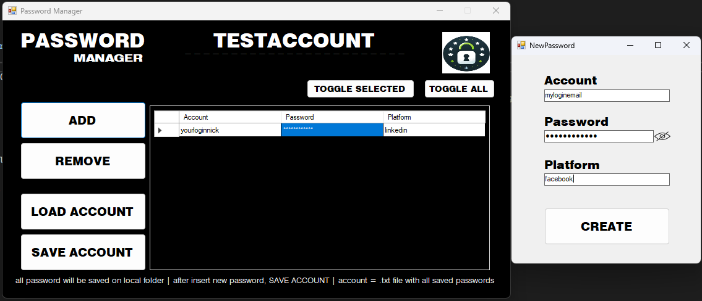

# password-manager

Another C# project developed with the goal of learning more about C# and .NET. This time, it's a password manager designed to prioritize other information in the human brain 🤣🧠

- [x] Insert new data (account [nickname, email], password, platform)
- [x] Toggle one or all password visibility 
- [ ] Save password list into binary file
- [ ] Load password from binary file
- [ ] Button to generate random password (with option to choose pattern)

